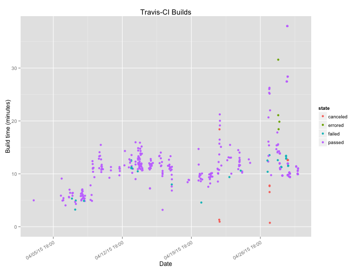

Travigraph
==========

This program uses the command line tools for Travis-CI to download the build statistics on a given project
and then it graphs the results using R and ggplot2.

The code is made of several modules

1. travigraph - A command line runner that downloads "pages" of builds in JSON format
2. regularize\_json - An R script for regularizing some data from the returned JSON
3. merge\_json - A custom R script to merge dataframes
4. process - An R script convert the build statistics in JSON format to a CSV file
4. plot - Rendering CSV results with ggplot2

Pre-requisites
---------------

- travis command line tool e.g. `gem install travis`
- R packages e.g. `install.packages(c-('ggplot2', 'chron', 'stringr', 'jsonlite'))`

Note: the travis command line tool should also be authenticated to your account before using this tool

Example
-------

Usage
----

    travigraph -r username/repo -b 50 -e 1000 -o output.png -cached

Options
-------

    -r Repo as username/reponame or organization/reponame, doesn't have to be your own! (required)
    -s Starting build number to process (required)
    -e Ending build number to process (required)
    -o Output image file (required)
    -t Temp directory to store intermediate files (optional)
    -w Width of image (optional)
    -h Height of image (optional)
    -cached Use already downloaded results for plotting (optional)
    -version Print version (optional)

Notes: Builds are normally "paged" 25 at a time via the API.

Known issues
-----------

For unknown reasons the -b option doesn't work at low values, try starting it at 50 or more
