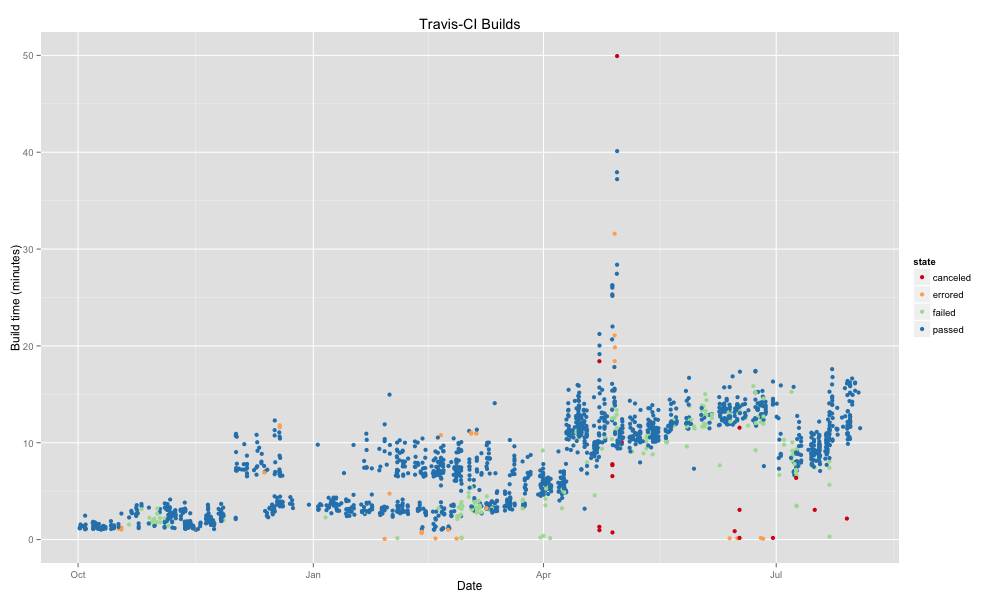

Travigraph v1.0.1
==========

This program uses the command line tools for Travis-CI to download the build statistics on a given project
and then it graphs the results using R and ggplot2.

The main program travigraph runs ruby-based travis command line tool to get build times and runs [jq](http://stedolan.github.io/jq/) and plot.R to format the output.

Pre-requisites
---------------

- travis command line tool e.g. `gem install travis`
- jq, a javascript JSON parser `brew install jq`
- R packages e.g. 'ggplot2', 'lubridate', 'scales', 'RColorBrewer'

Note: the travis command line tool should also be authenticated to your account. See http://www.rubydoc.info/gems/travis/1.8.0 for more info.

Example
-------

Usage
----

    travigraph -r username/repo -s 50 -e 1000

Options
-------

    -r Repo as username/reponame, doesn't have to be your own! (required)
    -s Starting build number to process (required)
    -e Ending build number to process (required)
    -o Output image file (required)
    -t Temp directory to store intermediate files (optional)
    -w Width of image (optional)
    -h Height of image (optional)
    -cached Use already downloaded results for plotting (optional)
    -version Print version (optional)

Notes: Builds are normally "paged" 25 at a time via the API.
